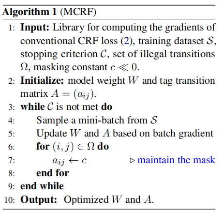
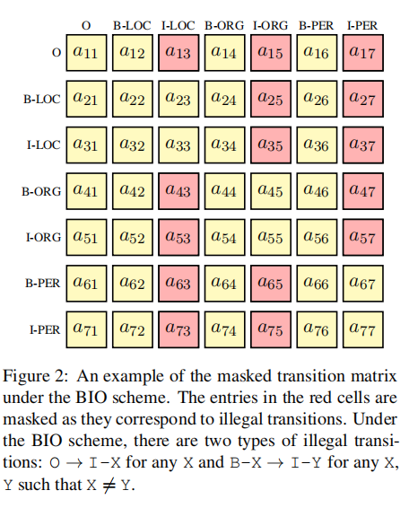
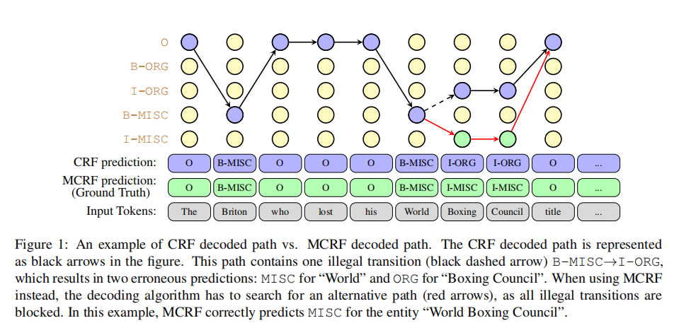

# Introduction

Masked Conditional Random Field (Masked-CRF) is an easy to implement variant CRF that impose restrictions on candidate paths during both training and decoding phases.

Masked CRF approach, formally given in Algorithm 1.


An example of transition matrix and the decoded path for CRF / Masked CRF:





For more detail, refer to our paper:

[Masked Conditional Random Fields for Sequence Labeling](https://arxiv.org/abs/2103.10682)


# Train and Evaluate
This example code fine-tunes Bert + Masked-CRF on ATIS data sets.

`train_mask`: whether to use Masked-CRF during training

`eval_mask`: whether to use Masked-CRF during evaluating

`lr_decay`: control the learning rate for each layer


For BIO format data file, such as `Resume`
```bash
python train_and_eval.py \
    --bert_config_file=conf/bert_config.json \
    --train_file=data/resume/train.char.bio \
    --test_files=data/resume/dev.char.bio,data/resume/test.char.bio \
    --data_format=cols \
    --max_seq_length=128 \
    --vocab_file=conf/vocab.txt \
    --do_lower_case=True \
    --output_dir=model/resume \
    --min_train_steps=1000 \
    --learning_rate=2e-5 \
    --do_train=True \
    --do_eval=True \
    --train_mask=True \
    --eval_mask=True \
    --lr_decay=1.0
```

For JSON format data file, such as `ATIS`

```bash
python train_and_eval.py \
    --bert_config_file=conf/uncased_bert_config.json \
    --train_file=data/atis/train.txt \
    --test_files=data/atis/dev.txt,data/atis/test.txt \
    --data_format=rows \
    --max_seq_length=128 \
    --vocab_file=conf/uncased_vocab.txt \
    --do_lower_case=True \
    --output_dir=model/tmp \
    --min_train_steps=1000 \
    --learning_rate=2e-5 \
    --do_train=True \
    --do_eval=True \
    --train_mask=True \
    --eval_mask=True \
    --lr_decay=1.0
```

# Performance
* Retain: Keep and retag the illegal segments.
This strategy agrees with ([Sang et al., 2000](https://www.aclweb.org/anthology/W00-0726/)).
* Discard: Discard the illegal segments completely.
* MCRF-decoding: A naive version of MCRF
that does masking only in decoding. The training process is the same as that in conventional
CRF.
* MCRF-training: The proper MCRF approach proposed in this work. The masking is
maintained in the training

|  Task   |  Bert-Softmax-Retain  |  Bert-Softmax-Discard  |  Bert-CRF-Retain  |  Bert-CRF-Discard  |  Bert-MCRF-Decoding  |  Bert-MCRF-Training  |
|  ----  | ----  | ---- | ---- | ---- | ----  | ---- |
| Resume | 95.7 | 96.2 | 95.9 | 97.2 | 97.3 | 97.6 |
| MSRA | 94.0 | 94.6 | 94.2 | 95.5 | 95.6 | 95.9 |
| Ontonotes | 78.1 | 80.7 | 81.8 | 83.1 | 83.2 | 83.7 |
| Weibo | 67.7 | 69.7 | 70.8 | 71.9 | 72.2 | 72.4 |
| ATIS | 95.2 | 95.6 | 95.5 | 95.8 | 95.8 | 95.9 |
| SNIPS | 93.2 | 93.5 | 94.6 | 95.1 | 95.1 | 95.3 |
| CoNLL2000 | 96.1 | 96.3 | 96.5 | 96.6 | 96.6 | 96.9 |
| CoNLL2003 | 90.1 | 90.4 | 90.4 | 90.6 | 91.2 | 91.7 |


# Cite
````
@misc{
    wei2021masked,
    title={Masked Conditional Random Fields for Sequence Labeling}, 
    author={Tianwen Wei and Jianwei Qi and Shenghuan He and Songtao Sun},
    year={2021},
    eprint={2103.10682},
    archivePrefix={arXiv},
    primaryClass={cs.LG}
}
````
